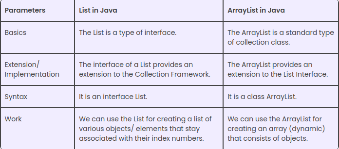

# Java foreach
```java
List<Serie> serieList = new ArrayList<>();
serieList.add(new Serie("Friends", 9, "SITCON", "Some guys"));
serieList.add(new Serie("Vinland Saga", 2, "IDK", "A guy"));
serieList.add(new Serie("HIMYM", 8, "SITCON", "FOX"));

for(Serie serie: serieList){
    serie.getName();
}
```

# Coleções em Java

Esta é a API que o Java nos fornece para gerenciar coleções (que é usada para estruturas de dados). Essas coleções não fazem parte da linguagem, fazem parte do `java.utils`.


# Lista
Esta é a diferença entre uma lista e um ArrayList.


https://docs.oracle.com/javase/8/docs/api/java/util/List.html

A classificação pode ser uma ordem natural definida por uma `Comparator interface` ou qualquer ordem específica definida por uma `Comparator interface` em Java.
Por exemplo:
```java
@Setter
@Getter
public class Funcionário {
    private String nome;
    private String sobrenome;
    private int idade;
}
```
```java
import java.util.Comparator;

public class FuncionarioComparator implements Comparator<Funcionário> {

    @Override
    public int compare(Funcionário o1, Funcionário o2) {
        return o1.getNome().compareTo(o2.getNome());
    }
}
```

# Set
`Set` e uma `interface` de Java. Provavelmente a diferença mais importante entre `HashSet` e `TreeSet` é o desempenho. O `HashSet` é mais rápido que o `TreeSet`, o que significa que se você precisar de desempenho, use o `HashSet`, mas o `HashSet` não fornece nenhum tipo de ordenação.


# 
Concluindo, a diferença entre listas e conjuntos é que em conjuntos você não pode usar certos métodos como `.get()` e em conjuntos você não pode repetir dados

